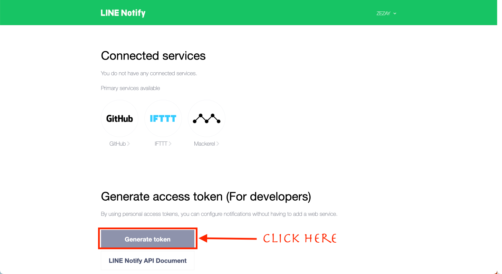
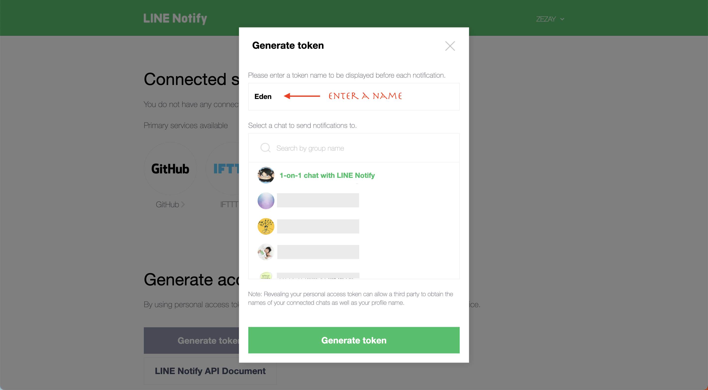

# Line Notify API

this API help you short cut your app to create Line Notify messages using this API.

GET:

```txt
https://line-007.herokuapp.com?token=<your-token>&mode=<payload-type>&payload=<your-payload>
```

|   mode    |            payload             |
| :-------: | :----------------------------: |
|  `text`   |        string (message)        |
| `sticker` | sticker_id, sticker_package_id |
| `picture` |           image URL            |

For the `token`, you can get it at https://notify-bot.line.me/my/ (don't forget to login)

Click Generate token



Enter your token name and choose `1-on-1 chat with LINE Notify` or `a group`



You will have to add friend with LINE Notify

And if you chose `a group`, you will have to invite LINE Notify to that group as well
